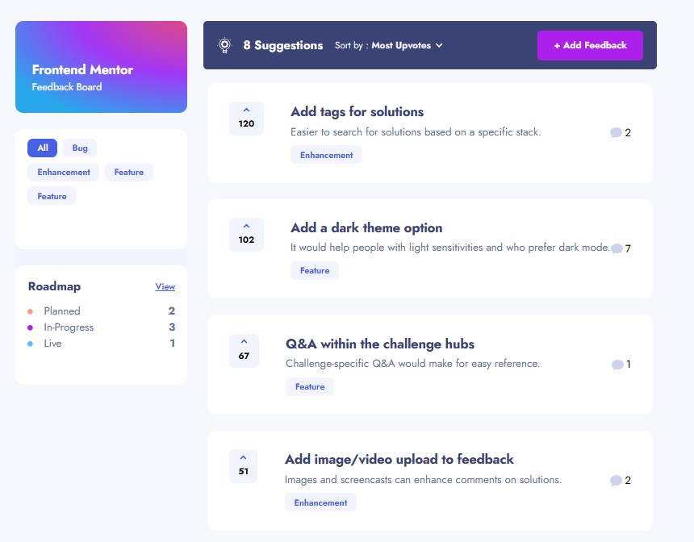

# Bicimex - Product Feedback App



## Introduction

Welcome to Bicimex - a product feedback application challenge design preview! In this challenge, I was tasked with building a responsive web application that allows users to submit, view, update, and delete product feedback requests. Additionally, users should be able to interact with the feedback, such as upvoting, commenting, and filtering by category. My challenge was to replicate the provided design as closely as possible while ensuring functionality and performance.

## Technologies Used

For this challenge, I utilized the following core technologies:

- **Next.js**: Next.js was chosen as the primary framework for its server-side rendering capabilities and efficient routing, which contribute to improved performance.
- **localStorage**: Utilized localStorage for client-side data persistence, ensuring that user data and preferences are retained even after browser refresh.
- **Tailwind CSS**: Tailwind CSS was employed for rapid and efficient styling, leveraging its utility-first approach to streamline the development process.
- **TypeScript**: TypeScript provided static typing capabilities, enhancing code quality, maintainability, and scalability.

## Features Implemented

### Core Features:

- **Responsive Design**: The application is designed to adapt seamlessly to various screen sizes, providing an optimal viewing experience across devices.
- **Data Population**: Initial data is loaded from the provided `data.json` file, ensuring that users have access to product feedback requests upon first load.
- **CRUD Operations**: Users can Create, Read, Update, and Delete product feedback requests, empowering them to actively engage with the platform.
- **Form Validations**: Form validations are implemented to ensure data integrity and provide feedback to users when creating or editing feedback requests.
- **Sorting and Filtering**: Users can sort suggestions by most/least upvotes and most/least comments, as well as filter suggestions by category, enhancing usability and navigation.
- **Comments and Replies**: Users can add comments and replies to product feedback requests, fostering community engagement and collaboration.
- **Upvoting**: Upvoting functionality enables users to express support for specific product feedback requests, influencing prioritization.
- **LocalStorage Persistence**: Changes made by users, such as upvotes, comments, and form data, are persisted using localStorage, ensuring a seamless browsing experience even after refreshing the browser.

### Bonus Features:

- **SSR and Pre-rendering**: Leveraging Next.js, the application is equipped with server-side rendering and pre-rendering capabilities, enhancing performance and SEO optimization.
- **Full-stack Potential**: Next.js facilitates potential future expansion into a full-stack application, with support for server-side rendering on the backend, enabling further optimization and scalability.

## Expected Behavior

- **Suggestions Page**: Only product feedback requests with a status of `suggestion` are displayed on the Suggestions page.
- **Roadmap**: Feedback requests with statuses of `planned`, `in-progress`, or `live` are showcased on the roadmap, sorted into columns based on their status and ordered by upvote totals.
- **Creating a Product Request**: New feedback requests are assigned a unique ID and default to a status of `suggestion`, placing them on the Suggestions page.
- **Editing Feedback**: Updating a feedback request's status to `planned`/`in-progress`/`live` moves it to the roadmap, reflecting the updated status and position.
- **Adding Comments/Replies**: User data from the `currentUser` object in `data.json` is utilized to populate comments and replies, with a maximum character limit of 250.

## Project Structure

```
/app
    /components      Components in figma file and Composite Components
    /contexts        Context for Sort and Categories
    /edit-feedback   (*Feedback Editing Page*)
    /lib             Hooks for Breaking and Scroll Disabling and other helpers
    /new-feedback    (*New Feedback Page*)
    /product-request (*Feedback Detail Page*)
    /roadmap         (*Roadmap Page*)
    favicon.ico      Provided Favicon
    globals.css      Global Css
    layout.tsx       Root Page Layout
    page.tsx         (*Dashboard Page*)
/patches             patches for tailwindest project typing
/public
    /assets          shared assets directory
    .*               data.json and .svg files used in the project.
```

## Getting Started

To get started with the project, follow these steps:

1. Clone the repository to your local machine.
2. Install dependencies using `npm install`.
3. Run the development server using `npm run dev`.
4. Access the application via the provided local server URL.

## Deployment

The project can be deployed using various hosting platforms, including:

- [GitHub Pages](https://pages.github.com/)
- [Vercel](https://vercel.com/)
- [Netlify](https://www.netlify.com/)

The project is currently deployed on Vercel.

## Conclusion

I thoroughly enjoyed working on this challenge and implementing the features outlined above. The combination of Next.js, Tailwind CSS, and TypeScript proved to be a powerful stack for building a performant and user-friendly product feedback application. I look forward to any feedback and further opportunities to enhance and expand upon this project.

**Thank you for the opportunity!** 🚀
